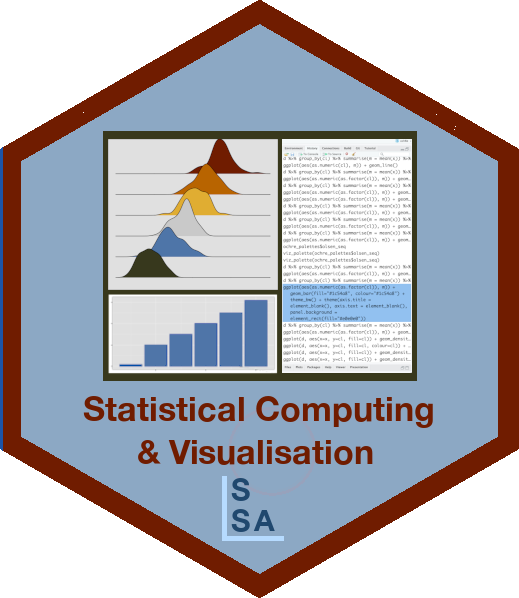

# SSA SCV Tutorial: Creating data plots for effective decision-making using statistical inference with R 



Website: [https://StatSocAus.github.io/tutorial_effective_data_plots](https://StatSocAus.github.io/tutorial_effective_data_plots)

## Structure of tutorial

- Review of making effective plots using ggplot2's grammar of graphics:
    - Organising your data to enable mapping variables to graphical elements, 
    - Common plot descriptions as scripts,
    - Do's and don'ts following cognitive perception principles.
- Making decisions and inferential statements based on data plots
    - What is your plot testing? Determining the hypothesis based on the type of plot.
    - Creating null samples to build lineups for comparison and testing.
    - Conducting a lineup test using your friends to determine whether what you see is real or spurious, and to determine the best design for your plot.

Background: Participants should have a good working knowledge of R, and tidy verse, and some experience with ggplot2. Familiarity with the material in R4DS (https://r4ds.hadley.nz) is helpful.

## Course Schedule

| time | topic |
|------|-------|
|1:00-1:15|	Why, philosophy and benefits|
|1:15-1:35|	Organising data to map variables to plots|
|1:35-2:05|	Making a variety of plots|
|2:05-2:30|	Do but don’t, and cognitive principles|
|2:30-3:00|	BREAK|
|3:00-3:20|	What is your plot testing?|
|3:20-3:35|	Creating null samples|
|3:35-4:00|	Conducting a lineup test|
|4:00-4:30|	Testing for best plot design|

[Session 1 Slides](https://statsocaus.github.io/tutorial_effective_data_plots/slides1.html)

[Session 2 Slides](https://statsocaus.github.io/tutorial_effective_data_plots/slides2.html)

[Zip file of materials](https://statsocaus.github.io/tutorial_effective_data_plots/tutorial.zip)

## Getting started

1. You should have a reasonably up to date version of R and R Studio, eg RStudio RStudio 2023.06.2 +561 and R version 4.3.1 (2023-06-16). Install the following packages, and their dependencies.

```
install.packages(c("ggplot2", "tidyr", "dplyr", "readr", "stringr", "nullabor", "colorspace", "palmerpenguins", "broom", "ggbeeswarm"), dependencies=c("Depends", "Imports"))
```

2. Download the [Zip file of materials](https://statsocaus.github.io/tutorial_effective_data_plots/tutorial.zip) to your laptop, and unzip it. 

3. Download just the R scripts, [slides1.R](https://statsocaus.github.io/tutorial_effective_data_plots/slides1.R), [slides2.R](https://statsocaus.github.io/tutorial_effective_data_plots/slides2.R)

4. Open your RStudio be clicking on `tutorial.Rproj`. 

GitHub repo with all materials is 
[https://statsocaus.github.io/tutorial_effective_data_plots/](https://statsocaus.github.io/tutorial_effective_data_plots/).

